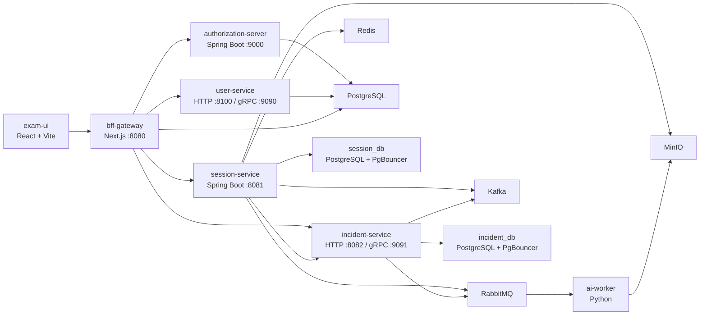

# Exam Cheating Detection System v2

Hệ thống giám sát thi trực tuyến theo kiến trúc microservices, tập trung vào xác thực người dự thi, quản lý phiên thi, phát hiện hành vi bất thường và lưu bằng chứng phục vụ hậu kiểm. Dự án kết hợp rule-based detection ở trình duyệt, AI worker xử lý ảnh/video, backend Spring Boot, BFF Next.js và hạ tầng chạy trên Kubernetes.

README này mô tả trạng thái hiện tại của repository. Đường chạy chính của repo là Docker image cục bộ kết hợp Kubernetes manifests; repo hiện không cung cấp `docker-compose.yml`, vì vậy README không dùng docker-compose làm quick start.

## Mục tiêu hệ thống

- Tổ chức phiên thi trực tuyến với đăng nhập OIDC/OAuth2, luồng PKCE và phân quyền theo vai trò.
- Ghi nhận các tín hiệu gian lận như rời tab, paste, không có mặt, nhiều khuôn mặt, nhìn lệch hướng và các sự kiện bất thường từ client.
- Thu thập bằng chứng qua ảnh/video/object storage để giám thị hoặc admin kiểm tra lại.
- Tách hệ thống thành các service độc lập để dễ mở rộng, kiểm thử tải và áp dụng security policy.
- Kiểm chứng luồng end-to-end bằng load test trong Kubernetes, bao gồm chế độ non-policy và policy-enabled.

## Tính năng chính

- Candidate exam flow: đăng ký/đăng nhập, bắt đầu phiên thi, lấy câu hỏi, nộp bài và gửi client incident.
- Proctoring signals: tab switch, blur/focus, paste, no-face, multiple-faces, looking-away và event severity.
- Browser-side AI: React/Vite frontend tích hợp TensorFlow.js, MediaPipe FaceMesh, BlazeFace và OpenCV.js.
- Backend orchestration: BFF proxy qua Next.js, JWT/OIDC, session management, incident ingestion và user/admin APIs.
- Evidence pipeline: RabbitMQ, MinIO, AI worker Python và các service xử lý bằng chứng.
- Observability/security-ready: Prometheus annotations, monitoring manifests, Istio AuthorizationPolicy và CiliumNetworkPolicy.
- Load testing: script kiểm thử full flow với 200 users hoặc nhiều hơn, chạy trực tiếp trong Kubernetes cluster.

## Kiến trúc tổng quan



## Thành phần chính

| Thành phần | Công nghệ | Port/Service | Vai trò |
| --- | --- | --- | --- |
| `frontends/exam-ui` | React 18, Vite, TypeScript, TensorFlow.js, MediaPipe, LiveKit | `5173` khi chạy local | Giao diện thi và phát hiện gian lận phía client |
| `gateways/bff` | Next.js 14, NextAuth, Redis, PostgreSQL, undici | `bff-gateway:8080` | Backend-for-Frontend, OIDC/PKCE, session cookie, proxy API |
| `services/auth-server` | Spring Boot, OAuth2 Authorization Server | `authorization-server:9000` | Cấp token, JWKS, userinfo và cấu hình OAuth client |
| `services/user-service` | Spring Boot, PostgreSQL, gRPC | `user-service:8100`, `:9090` | Quản lý user và hồ sơ người dùng |
| `services/admin-service` | Spring Boot, gRPC client | `admin-service:8200` | API cho admin/proctor |
| `services/session-service` | Spring Boot, PostgreSQL, Redis, RabbitMQ, Kafka, MinIO, LiveKit | `session-service:8081` | Quản lý phiên thi, câu hỏi, submit, media/evidence workflow |
| `services/incident-service` | Spring Boot, PostgreSQL, Kafka, RabbitMQ, gRPC | `incident-service:8082`, `:9091` | Nhận và lưu incident, client event, severity/state |
| `ai-worker` | Python, OpenCV, YOLOv8, EasyOCR, MediaPipe, InsightFace | Internal worker | Xử lý tác vụ AI qua RabbitMQ và MinIO |
| `k8s/infra` | Kubernetes manifests | Namespace `exam-platform` | PostgreSQL, Redis, RabbitMQ, Kafka, MinIO, LiveKit, Debezium |
| `k8s/apps` | Kubernetes manifests | App deployments/jobs | Microservices, service accounts, HPA, load-test jobs |
| `k8s/istio` | Istio manifests | Mesh/Gateway policies | mTLS, gateway routing và AuthorizationPolicy |
| `k8s/policies` | CiliumNetworkPolicy | Network policy | Giới hạn traffic service-to-service |
| `k8s/monitoring` | Prometheus, Grafana, Loki, Tempo | Internal/port-forward | Metrics, logs và tracing trong môi trường dev/test |

## Tech stack

- Frontend: React 18, Vite 5, TypeScript, Tailwind CSS, LiveKit client, TensorFlow.js, MediaPipe, OpenCV.js.
- BFF: Next.js 14, NextAuth, OpenID Connect, Redis, PostgreSQL, undici connection pooling.
- Backend: Java 17, Spring Boot 3.x, Spring Security, OAuth2 Resource Server, gRPC, Maven/Gradle theo từng service.
- Data and messaging: PostgreSQL 16, PgBouncer, Redis 7, RabbitMQ 3, Kafka 7.5, Debezium, MinIO.
- AI worker: Python, OpenCV, YOLOv8, EasyOCR, MediaPipe, InsightFace, ONNX Runtime.
- Platform: Docker, Kubernetes, optional Istio, optional Cilium, optional monitoring stack.
- Test: Python asyncio/aiohttp load tests, PowerShell wrappers, Kubernetes Jobs.

## Cấu trúc thư mục

```text
.
|-- ai-worker/                 # Python workers cho face verification/video analysis
|-- frontends/exam-ui/         # React/Vite exam UI
|-- gateways/bff/              # Next.js Backend-for-Frontend
|-- infra/                     # Tài nguyên hạ tầng phụ trợ ngoài k8s nếu có
|-- k8s/
|   |-- apps/                  # Microservices, service accounts, HPA, load-test jobs
|   |-- infra/                 # Databases, cache, queue, object storage, LiveKit, Debezium
|   |-- istio/                 # Mesh config, gateway, authorization policies
|   |-- monitoring/            # Prometheus, Grafana, Loki, Tempo
|   `-- policies/              # Cilium network policies
|-- services/
|   |-- admin-service/
|   |-- auth-server/
|   |-- incident-service/
|   |-- session-service/
|   `-- user-service/
`-- tests/
    |-- non-policy/            # Python load test không bật policy
    |-- policy/                # Python load test khi bật policy
    |-- rules/                 # Script bật/tắt security rules
    |-- run-load-test-k8s.ps1
    `-- run-load-test-policy-k8s.ps1
```

## Yêu cầu môi trường

Khuyến nghị cho môi trường local/dev:

- Windows PowerShell hoặc PowerShell 7.
- Docker Desktop có Kubernetes enabled, hoặc một Kubernetes cluster tương đương.
- `kubectl` trỏ đúng context.
- Java 17 cho các Spring Boot service.
- Node.js 18.17+ hoặc Node.js 20 LTS cho BFF và frontend.
- Python 3.10+ cho AI worker và load-test scripts.
- Tài nguyên tối thiểu khi chạy full stack local: 8 CPU, 12-16 GB RAM. Với policy, monitoring và load test 200 users, nên cấp nhiều tài nguyên hơn cho Docker/Kubernetes.

Kiểm tra nhanh context:

```powershell
kubectl config current-context
kubectl get nodes
docker version
```

## Build Docker images

Các manifest trong `k8s/apps/microservices.yaml` dùng image cục bộ với `imagePullPolicy: IfNotPresent`. Trước khi apply app manifests, build image trong Docker daemon mà Kubernetes local đang dùng.

Chạy từ root repository:

```powershell
docker build -t exam-auth-server:latest ./services/auth-server
docker build -t exam-user-service:latest ./services/user-service
docker build -t exam-admin-service:latest ./services/admin-service
docker build -t exam-session-service:latest ./services/session-service
docker build -t exam-incident-service:latest ./services/incident-service
docker build -t exam-bff:latest ./gateways/bff
docker build -t exam-ai-worker:latest ./ai-worker
```

Nếu dùng `kind` thay vì Docker Desktop Kubernetes, cần load image vào cluster:

```powershell
kind load docker-image exam-auth-server:latest
kind load docker-image exam-user-service:latest
kind load docker-image exam-admin-service:latest
kind load docker-image exam-session-service:latest
kind load docker-image exam-incident-service:latest
kind load docker-image exam-bff:latest
kind load docker-image exam-ai-worker:latest
```

## Deploy Kubernetes

### 1. Deploy hạ tầng

```powershell
kubectl apply -f k8s/infra/storage.yaml
kubectl apply -f k8s/infra/session-db.yaml
kubectl apply -f k8s/infra/incident-db.yaml
kubectl apply -f k8s/infra/services-infra.yaml
kubectl apply -f k8s/infra/livekit-services.yaml
kubectl apply -f k8s/infra/debezium.yaml
```

Theo dõi pod hạ tầng:

```powershell
kubectl get pods -n exam-platform
```

### 2. Deploy ứng dụng

```powershell
kubectl apply -f k8s/apps/service-accounts.yaml
kubectl apply -f k8s/apps/microservices.yaml
```

Chờ deployment sẵn sàng:

```powershell
kubectl wait --for=condition=available deployment --all -n exam-platform --timeout=300s
kubectl get pods -n exam-platform
```

HPA là tùy chọn và cần metrics server hoạt động:

```powershell
kubectl apply -f k8s/apps/hpa.yaml
```

### 3. Port-forward để truy cập local

BFF:

```powershell
kubectl port-forward svc/bff-gateway 8080:8080 -n exam-platform
```

Auth server:

```powershell
kubectl port-forward svc/authorization-server 9000:9000 -n exam-platform
```

MinIO console nếu cần kiểm tra evidence/object storage:

```powershell
kubectl port-forward svc/minio 9002:9001 -n exam-platform
```

### 4. Chạy frontend local

`exam-ui` hiện là frontend app riêng. Trong luồng dev, chạy UI local và trỏ API về BFF đã port-forward.

```powershell
cd frontends/exam-ui
npm install
npm run dev
```

Mặc định Vite chạy tại:

```text
http://localhost:5173
```

## Security policy mode

Repo có hai nhóm policy chính:

- Istio: `k8s/istio/mesh-configs.yaml`, `k8s/istio/ingress-gateway.yaml`.
- Cilium: `k8s/policies/cilium-policies.yaml`.

Bật security rules bằng script:

```powershell
powershell -ExecutionPolicy Bypass -File .\tests\rules\enable-security-rules.ps1
```

Kiểm tra policy:

```powershell
kubectl get authorizationpolicy -n exam-platform
kubectl get ciliumnetworkpolicy -n exam-platform
kubectl get pods -n exam-platform
```

Tắt policy để quay lại non-policy mode:

```powershell
powershell -ExecutionPolicy Bypass -File .\tests\rules\disable-security-rules.ps1
```

Lưu ý quan trọng:

- Policy test yêu cầu security stack đang active trước khi chạy.
- OAuth client `exam-bff-client` phải hỗ trợ `authorization_code` và redirect URI `http://localhost:8080/login/oauth2/code/exam-oidc` cho luồng PKCE.
- Cilium trên Docker Desktop có thể không attach/enforce workload endpoint giống một cluster dùng Cilium làm CNI thật. Nếu cần kết luận chính xác về network policy enforcement, nên chạy trên cluster mà Cilium là CNI chính, ví dụ kind/k3d/minikube được cài Cilium đúng cách hoặc cluster thật.
- Secret trong manifest hiện phục vụ dev/test. Không dùng trực tiếp cho production.

## Load testing

Load test chạy dưới dạng Kubernetes Job trong namespace `exam-platform`. Không chạy các script này nếu cluster chưa ổn định hoặc chưa đủ tài nguyên.

### Non-policy full stack test

Script wrapper:

```powershell
powershell -ExecutionPolicy Bypass -File .\tests\run-load-test-k8s.ps1 -Users 200 -QuestionsDuration 20 -IncidentsPerUser 20
```

Theo dõi log:

```powershell
kubectl logs -f job/load-test-non-policy -n exam-platform
```

Lấy report cuối:

```powershell
kubectl logs job/load-test-non-policy -n exam-platform
```

Script Python tương ứng:

```text
tests/non-policy/load_test_all_apis.py
```

### Policy-enabled full stack test

Trước khi chạy:

1. Bật security rules.
2. Kiểm tra OAuth client đã sẵn sàng cho PKCE.
3. Kiểm tra `authorization-server`, `bff-gateway`, `session-service`, `incident-service`, Kafka, RabbitMQ và database đều `Running`/`Ready`.

Chạy qua cấu hình mặc định của script:

```powershell
powershell -ExecutionPolicy Bypass -File .\tests\run-load-test-policy-k8s.ps1 -Users 200 -QuestionsDuration 20 -IncidentsPerUser 20
```

Nếu Istio ingress trong môi trường local chưa sẵn sàng nhưng cần kiểm tra functional policy flow qua BFF service nội bộ, có thể override BFF URL:

```powershell
powershell -ExecutionPolicy Bypass -File .\tests\run-load-test-policy-k8s.ps1 -Users 200 -QuestionsDuration 20 -IncidentsPerUser 20 -BffUrl "http://bff-gateway:8080"
```

Theo dõi log:

```powershell
kubectl logs -f job/load-test-policy -n exam-platform
```

Script Python tương ứng:

```text
tests/policy/load_test_with_policy.py
```

### Luồng kiểm thử 200 users

Các script load test mô phỏng luồng:

1. Register users qua BFF.
2. Login bằng OIDC Authorization Code Flow với PKCE.
3. Gọi `userinfo` hoặc xác thực token.
4. Start exam session.
5. Stress API lấy câu hỏi theo nhịp nhiều request/giây.
6. Submit bài thi.
7. Flood client incident events qua BFF tới incident service.

Kết quả 200 users nên được đọc theo từng phase, không chỉ theo trạng thái `Completed` của Job. Các điểm cần theo dõi kỹ:

- Tỷ lệ login PKCE thành công.
- Lỗi `401/403` trong policy checks.
- Latency p95/p99 của BFF và session-service.
- Timeout hoặc `ECONNRESET` trong incident flood.
- Kafka/ZooKeeper readiness và topic metadata khi incident-service publish event.
- Database connection pool khi nhiều user gọi auth/userinfo đồng thời.

## Monitoring

Manifest monitoring nằm trong `k8s/monitoring`. Có thể apply khi cần quan sát metrics/logs/traces:

```powershell
kubectl apply -f k8s/monitoring
```

Ví dụ port-forward:

```powershell
kubectl port-forward svc/prometheus-service 9090:9090 -n exam-platform
kubectl port-forward svc/grafana-service 3000:3000 -n exam-platform
```

Monitoring là tùy chọn trong môi trường dev, nhưng nên bật khi debug load test hoặc policy test.

## Troubleshooting

### Pod `ImagePullBackOff`

Nguyên nhân thường gặp là image chưa được build trong Docker daemon của cluster local.

```powershell
docker images | findstr exam-
kubectl describe pod <pod-name> -n exam-platform
```

Với `kind`, cần `kind load docker-image`.

### PKCE login fail hoặc token trả `400`

Kiểm tra OAuth client `exam-bff-client` trong `identity_db`:

- Grant type phải có `authorization_code`.
- Redirect URI phải có `http://localhost:8080/login/oauth2/code/exam-oidc`.
- Client id/secret phải khớp `BFF_CLIENT_ID` và `BFF_CLIENT_SECRET` trong BFF/auth-server manifests.

Sau khi chỉnh DB hoặc migration, restart auth server:

```powershell
kubectl rollout restart deployment/authorization-server -n exam-platform
kubectl rollout status deployment/authorization-server -n exam-platform --timeout=120s
```

### Incident flood timeout

Kiểm tra BFF, incident-service và Kafka:

```powershell
kubectl logs deployment/bff-gateway -n exam-platform
kubectl logs deployment/incident-service -n exam-platform
kubectl logs deployment/kafka -n exam-platform
kubectl get pods -n exam-platform
```

Nếu log incident-service báo topic không có metadata hoặc Kafka crash, kiểm tra Kafka/ZooKeeper trước khi kết luận API lỗi. Manifest hiện tại dùng `emptyDir` cho `kafka-data` trong `k8s/infra/services-infra.yaml`; khi restart pod hoặc Docker Desktop mất trạng thái, Kafka có thể cần được reset sạch hoặc chuyển sang PVC/StatefulSet cho test dài hạn.

### Cilium policy không enforce trên Docker Desktop

Docker Desktop Kubernetes không phải môi trường lý tưởng để xác nhận Cilium enforcement. Dấu hiệu thường gặp là Cilium pod chạy nhưng workload endpoint không xuất hiện như mong đợi. Với mục tiêu xác nhận network policy thật, dùng cluster có Cilium làm CNI chính.

### HPA không hoạt động

`k8s/apps/hpa.yaml` cần metrics server. Nếu `kubectl top pods` không trả dữ liệu, HPA sẽ không scale đúng.

### Cluster local bị quá tải khi test 200 users

Giảm song song để khoanh vùng lỗi trước:

```powershell
powershell -ExecutionPolicy Bypass -File .\tests\run-load-test-k8s.ps1 -Users 50 -QuestionsDuration 10 -IncidentsPerUser 5
```

Sau khi các phase ổn định, tăng dần lên 100 và 200 users. Khi debug 200 users, ưu tiên xem log theo phase thay vì chỉ xem tổng số request fail.

## Ghi chú production

Repo hiện ưu tiên môi trường dev/test và kiểm chứng kỹ thuật. Trước khi đưa vào production cần tối thiểu:

- Thay toàn bộ secret mặc định bằng Kubernetes Secret hoặc secret manager.
- Dùng TLS/HTTPS cho ingress, BFF, auth redirect và object storage.
- Tách storage bền vững cho Kafka, PostgreSQL, RabbitMQ, Redis và MinIO.
- Thiết lập resource request/limit theo kết quả benchmark thật.
- Bật monitoring, alerting và log retention.
- Xác nhận policy enforcement trên cluster thật, không chỉ Docker Desktop.
- Hardening OAuth client, cookie, CORS, CSRF và session expiration.

## Tài liệu và điểm vào quan trọng

- Kubernetes apps: `k8s/apps/microservices.yaml`
- Kubernetes infra: `k8s/infra/`
- Istio policies: `k8s/istio/`
- Cilium policies: `k8s/policies/cilium-policies.yaml`
- Non-policy load test: `tests/run-load-test-k8s.ps1`, `tests/non-policy/load_test_all_apis.py`
- Policy load test: `tests/run-load-test-policy-k8s.ps1`, `tests/policy/load_test_with_policy.py`
- Security rule scripts: `tests/rules/enable-security-rules.ps1`, `tests/rules/disable-security-rules.ps1`
- BFF gateway: `gateways/bff`
- Exam UI: `frontends/exam-ui`
- Java services: `services`
- AI worker: `ai-worker`

## License

Xem `LICENSE` trong repository.
