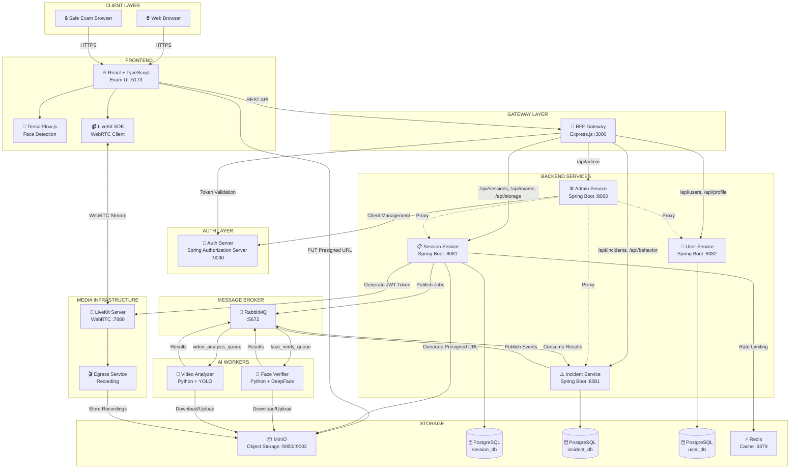
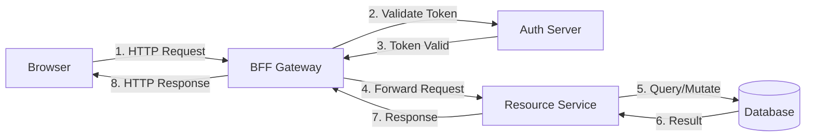
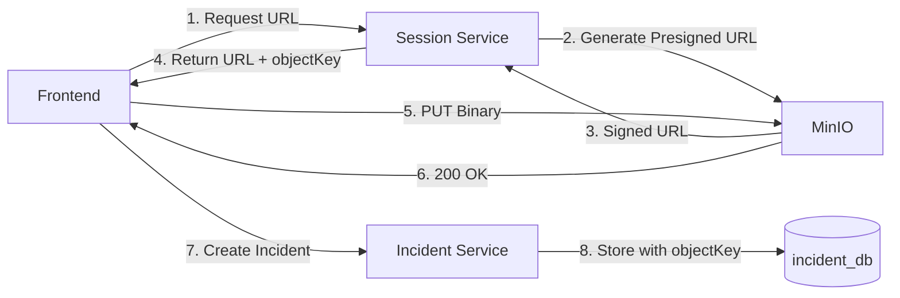
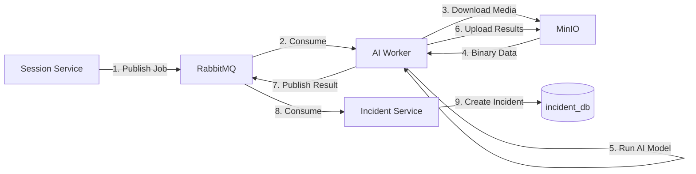
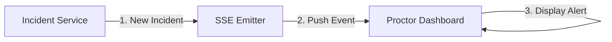

# High-Level System Architecture Diagram

## Sơ Đồ Kiến Trúc Tổng Quan - Hệ Thống Giám Sát Thi Trực Tuyến

---

## 1. Architecture Overview



<details>
<summary>📋 Copy Mermaid Code</summary>

```
graph TB
    subgraph "CLIENT LAYER"
        BROWSER[🌐 Web Browser]
        SEB[🔒 Safe Exam Browser]
    end
    
    subgraph "FRONTEND"
        REACT[⚛️ React + TypeScript<br/>Exam UI :5173]
        TFJS[🧠 TensorFlow.js<br/>Face Detection]
        LKSDK[📹 LiveKit SDK<br/>WebRTC Client]
    end
    
    subgraph "GATEWAY LAYER"
        BFF[🚪 BFF Gateway<br/>Express.js :3000]
    end
    
    subgraph "AUTH LAYER"
        AUTH[🔐 Auth Server<br/>Spring Authorization Server :9090]
    end
    
    subgraph "BACKEND SERVICES"
        SESSION[📋 Session Service<br/>Spring Boot :8081]
        INCIDENT[⚠️ Incident Service<br/>Spring Boot :8081]
        USERVC[👤 User Service<br/>Spring Boot :8082]
        ADMIN[⚙️ Admin Service<br/>Spring Boot :8083]
    end
    
    subgraph "AI WORKERS"
        FACE[🤖 Face Verifier<br/>Python + DeepFace]
        YOLO[🎯 Video Analyzer<br/>Python + YOLO]
    end
    
    subgraph "MESSAGE BROKER"
        RABBIT[🐰 RabbitMQ<br/>:5672]
    end
    
    subgraph "MEDIA INFRASTRUCTURE"
        LIVEKIT[📡 LiveKit Server<br/>WebRTC :7880]
        EGRESS[🎬 Egress Service<br/>Recording]
    end
    
    subgraph "STORAGE"
        MINIO[📦 MinIO<br/>Object Storage :9000/:9002]
        PG_SESSION[(🗄️ PostgreSQL<br/>session_db)]
        PG_INCIDENT[(🗄️ PostgreSQL<br/>incident_db)]
        PG_USER[(🗄️ PostgreSQL<br/>user_db)]
        REDIS[⚡ Redis<br/>Cache :6379]
    end

    %% Client to Frontend
    BROWSER -->|HTTPS| REACT
    SEB -->|HTTPS| REACT
    
    %% Frontend internal
    REACT --> TFJS
    REACT --> LKSDK
    
    %% Frontend to Gateway
    REACT -->|REST API| BFF
    
    %% Frontend to LiveKit (Direct WebRTC)
    LKSDK <-->|WebRTC Stream| LIVEKIT
    
    %% Frontend to MinIO (Direct Upload)
    REACT -->|PUT Presigned URL| MINIO
    
    %% Gateway to Auth
    BFF -->|Token Validation| AUTH
    
    %% Gateway to Services
    BFF -->|/api/sessions, /api/exams, /api/storage| SESSION
    BFF -->|/api/incidents, /api/behavior| INCIDENT
    BFF -->|/api/users, /api/profile| USERVC
    BFF -->|/api/admin| ADMIN
    
    %% Services to Databases
    SESSION --> PG_SESSION
    INCIDENT --> PG_INCIDENT
    USERVC --> PG_USER
    
    %% Services to Infrastructure
    SESSION -->|Generate Presigned URL| MINIO
    SESSION -->|Generate JWT Token| LIVEKIT
    SESSION -->|Publish Jobs| RABBIT
    INCIDENT -->|Publish Events| RABBIT
    SESSION -->|Rate Limiting| REDIS
    
    %% Admin Service Proxy
    ADMIN -.->|Proxy| SESSION
    ADMIN -.->|Proxy| USERVC
    ADMIN -.->|Proxy| INCIDENT
    ADMIN -->|Client Management| AUTH
    
    %% RabbitMQ to AI Workers
    RABBIT -->|face_verify_queue| FACE
    RABBIT -->|video_analysis_queue| YOLO
    
    %% AI Workers to Storage
    FACE -->|Download/Upload| MINIO
    YOLO -->|Download/Upload| MINIO
    
    %% AI Workers Results
    FACE -->|Results| RABBIT
    YOLO -->|Results| RABBIT
    RABBIT -->|Consume Results| INCIDENT
    
    %% LiveKit Egress
    LIVEKIT --> EGRESS
    EGRESS -->|Store Recordings| MINIO
```

</details>

---

## 2. Data Flow Patterns

### 2.1 Request/Response Flow (Synchronous)



<details>
<summary>📋 Copy Mermaid Code</summary>

```
graph LR
    A[Browser] -->|1. HTTP Request| B[BFF Gateway]
    B -->|2. Validate Token| C[Auth Server]
    C -->|3. Token Valid| B
    B -->|4. Forward Request| D[Resource Service]
    D -->|5. Query/Mutate| E[(Database)]
    E -->|6. Result| D
    D -->|7. Response| B
    B -->|8. HTTP Response| A
```

</details>

### 2.2 Evidence Upload Flow (Asynchronous)



<details>
<summary>📋 Copy Mermaid Code</summary>

```
graph LR
    A[Frontend] -->|1. Request URL| B[Session Service]
    B -->|2. Generate Presigned URL| C[MinIO]
    C -->|3. Signed URL| B
    B -->|4. Return URL + objectKey| A
    A -->|5. PUT Binary| C
    C -->|6. 200 OK| A
    A -->|7. Create Incident| D[Incident Service]
    D -->|8. Store with objectKey| E[(incident_db)]
```

</details>

### 2.3 AI Analysis Flow (Event-Driven)



<details>
<summary>📋 Copy Mermaid Code</summary>

```
graph LR
    A[Session Service] -->|1. Publish Job| B[RabbitMQ]
    B -->|2. Consume| C[AI Worker]
    C -->|3. Download Media| D[MinIO]
    D -->|4. Binary Data| C
    C -->|5. Run AI Model| C
    C -->|6. Upload Results| D
    C -->|7. Publish Result| B
    B -->|8. Consume| E[Incident Service]
    E -->|9. Create Incident| F[(incident_db)]
```

</details>

### 2.4 Real-time Notification Flow (SSE)



<details>
<summary>📋 Copy Mermaid Code</summary>

```
graph LR
    A[Incident Service] -->|1. New Incident| B[SSE Emitter]
    B -->|2. Push Event| C[Proctor Dashboard]
    C -->|3. Display Alert| C
```

</details>

---

## 3. Component Summary

| Layer | Component | Technology | Port | Description |
|-------|-----------|------------|------|-------------|
| **Client** | Web Browser | Chrome/Firefox | - | Standard browser |
| **Client** | Safe Exam Browser | SEB | - | Lockdown browser |
| **Frontend** | Exam UI | React + TypeScript | 5173 | Main web application |
| **Frontend** | TensorFlow.js | BlazeFace + FaceMesh | - | Client-side AI detection |
| **Frontend** | LiveKit SDK | WebRTC | - | Video streaming client |
| **Gateway** | BFF Gateway | Express.js | 3000 | API gateway, routing |
| **Auth** | Auth Server | Spring Authorization Server | 9090 | OAuth 2.0 / JWT |
| **Backend** | Session Service | Spring Boot | 8081 | Exams, Sessions, Storage |
| **Backend** | Incident Service | Spring Boot | 8081 | Violations, SSE, Behavior |
| **Backend** | User Service | Spring Boot | 8082 | Users, Profile, Identity |
| **Backend** | Admin Service | Spring Boot | 8083 | Admin proxy, Metrics |
| **AI** | Face Verifier | Python + DeepFace | - | Face comparison |
| **AI** | Video Analyzer | Python + YOLO | - | Object detection |
| **Infra** | LiveKit | WebRTC SFU | 7880 | Media server |
| **Infra** | Egress | Recording Service | 7881 | Server-side recording |
| **Infra** | RabbitMQ | Message Broker | 5672 | Async messaging |
| **Storage** | MinIO | S3-compatible | 9000/9002 | Object storage |
| **Storage** | PostgreSQL | Relational DB | 5432 | 3 databases |
| **Storage** | Redis | In-memory cache | 6379 | Caching, rate limiting |

---

## 4. Key Architectural Decisions

1. **BFF Pattern**: Single entry point cho frontend, routing logic tập trung
2. **Microservices**: Tách biệt concerns, scale độc lập
3. **Direct Upload**: Frontend → MinIO, không qua Spring Boot
4. **Event-Driven AI**: RabbitMQ decouple AI processing
5. **Server-Side Recording**: LiveKit Egress cho evidence đáng tin cậy
6. **Presigned URLs**: Secure, time-limited access to storage
