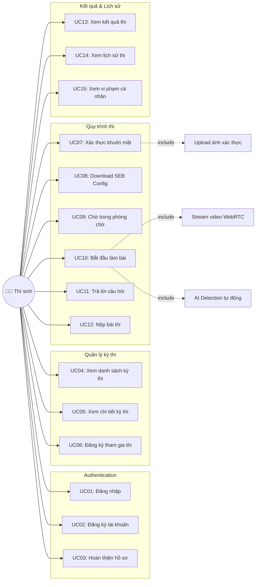
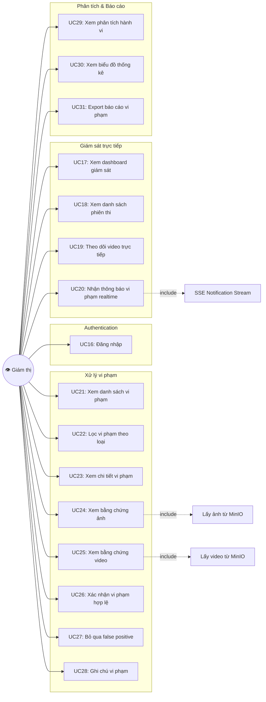
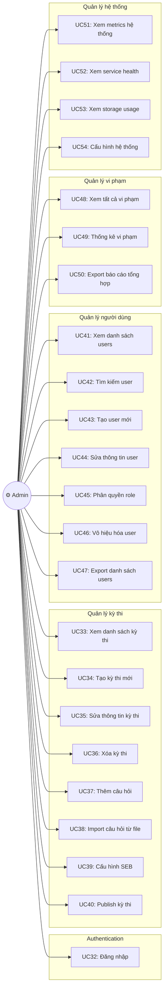
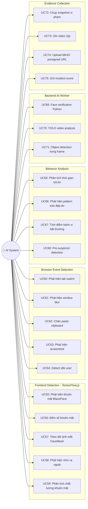
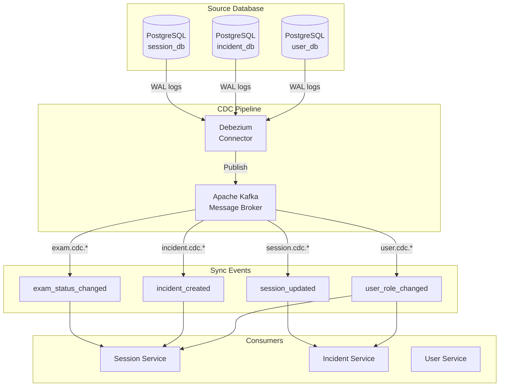
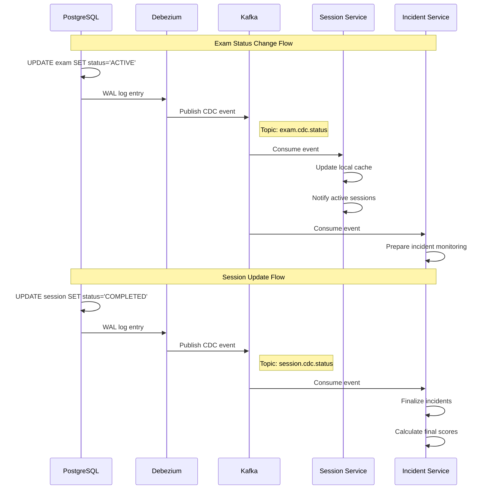
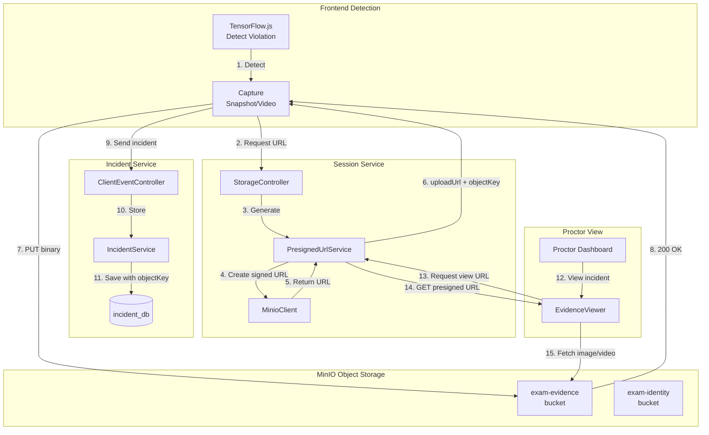
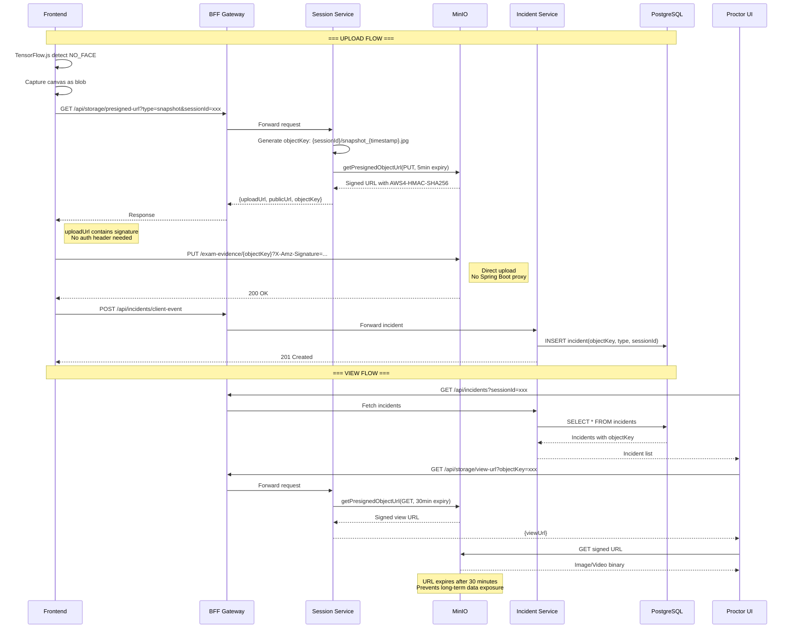
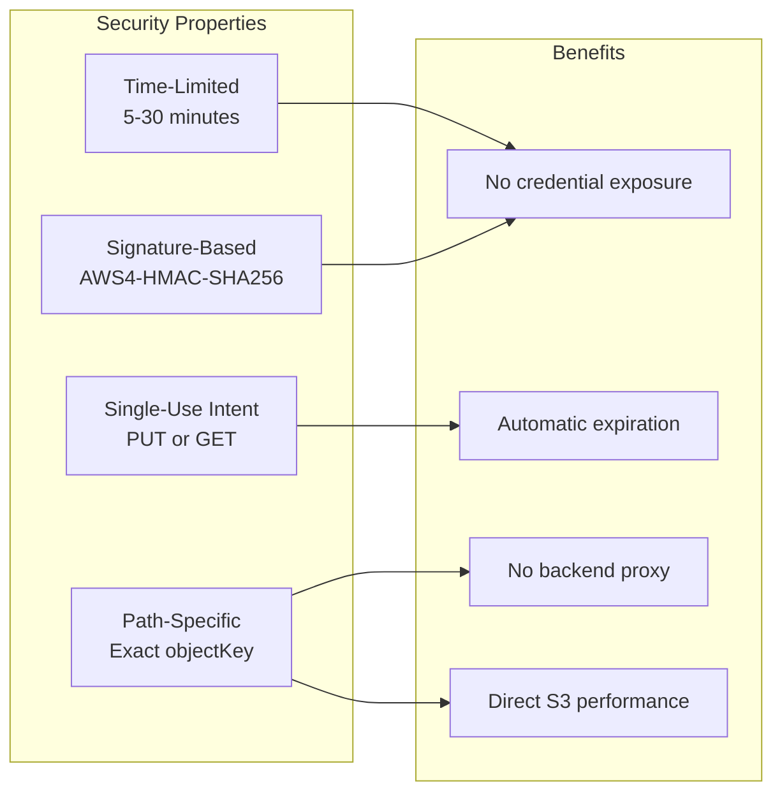

# Use Case Diagram - Hệ Thống Giám Sát Thi Trực Tuyến

## Tổng Quan

Tài liệu này mô tả các nhóm người dùng (Actors) và chức năng tương tác (Use Cases) trong hệ thống Exam Cheating Detection.

---

## 1. Actors (Nhóm Người Dùng)

| Actor | Mô Tả | Role Code |
|-------|-------|-----------|
| **Thí sinh (Candidate)** | Sinh viên tham gia kỳ thi trực tuyến | `CANDIDATE` |
| **Giám thị (Proctor)** | Người giám sát, review violations | `PROCTOR` |
| **Quản trị viên (Admin)** | Quản lý hệ thống, users, exams | `ADMIN` |

---

## 2. Use Case Diagram - Thí Sinh (Candidate)



<details>
<summary>📋 Copy Mermaid Code - Thí Sinh</summary>

```
graph LR
    CANDIDATE((👨‍🎓 Thí sinh))
    
    subgraph "Authentication"
        UC01[UC01: Đăng nhập]
        UC02[UC02: Đăng ký tài khoản]
        UC03[UC03: Hoàn thiện hồ sơ]
    end
    
    subgraph "Quản lý kỳ thi"
        UC04[UC04: Xem danh sách kỳ thi]
        UC05[UC05: Xem chi tiết kỳ thi]
        UC06[UC06: Đăng ký tham gia thi]
    end
    
    subgraph "Quy trình thi"
        UC07[UC07: Xác thực khuôn mặt]
        UC08[UC08: Download SEB Config]
        UC09[UC09: Chờ trong phòng chờ]
        UC10[UC10: Bắt đầu làm bài]
        UC11[UC11: Trả lời câu hỏi]
        UC12[UC12: Nộp bài thi]
    end
    
    subgraph "Kết quả & Lịch sử"
        UC13[UC13: Xem kết quả thi]
        UC14[UC14: Xem lịch sử thi]
        UC15[UC15: Xem vi phạm cá nhân]
    end
    
    CANDIDATE --> UC01
    CANDIDATE --> UC02
    CANDIDATE --> UC03
    CANDIDATE --> UC04
    CANDIDATE --> UC05
    CANDIDATE --> UC06
    CANDIDATE --> UC07
    CANDIDATE --> UC08
    CANDIDATE --> UC09
    CANDIDATE --> UC10
    CANDIDATE --> UC11
    CANDIDATE --> UC12
    CANDIDATE --> UC13
    CANDIDATE --> UC14
    CANDIDATE --> UC15
    
    UC10 -.->|include| UC_STREAM[Stream video WebRTC]
    UC10 -.->|include| UC_DETECT[AI Detection tự động]
    UC07 -.->|include| UC_UPLOAD[Upload ảnh xác thực]
```

</details>

### Chi tiết Use Cases - Thí Sinh

| ID | Use Case | Mô Tả | Tiền điều kiện | Hậu điều kiện |
|----|----------|-------|----------------|---------------|
| UC01 | Đăng nhập | Xác thực OAuth 2.0 | Có tài khoản | Vào dashboard |
| UC02 | Đăng ký | Tạo tài khoản mới | - | Chờ xác nhận email |
| UC03 | Hoàn thiện hồ sơ | Cập nhật thông tin cá nhân | Đăng nhập lần đầu | Có thể thi |
| UC04 | Xem danh sách kỳ thi | Hiển thị các kỳ thi có thể tham gia | Đã đăng nhập | - |
| UC05 | Xem chi tiết kỳ thi | Xem thông tin, thời gian, yêu cầu | Chọn kỳ thi | - |
| UC06 | Đăng ký tham gia | Ghi danh vào kỳ thi | Đủ điều kiện | Được thêm vào danh sách |
| UC07 | Xác thực khuôn mặt | Chụp ảnh để AI verify | Đến giờ thi | Pass/Fail xác thực |
| UC08 | Download SEB | Tải config Safe Exam Browser | Thi yêu cầu SEB | Có file .seb |
| UC09 | Phòng chờ | Đợi đến thời gian thi | Đã xác thực | Vào phòng thi |
| UC10 | Bắt đầu làm bài | Kết nối LiveKit, bật camera | Đến giờ thi | Session active |
| UC11 | Trả lời câu hỏi | Chọn/nhập đáp án | Đang thi | Lưu câu trả lời |
| UC12 | Nộp bài | Kết thúc và submit | Hoàn thành/hết giờ | Điểm được tính |
| UC13 | Xem kết quả | Xem điểm, thống kê | Đã nộp bài | - |
| UC14 | Xem lịch sử | Danh sách các kỳ thi đã tham gia | Đã đăng nhập | - |
| UC15 | Xem vi phạm | Xem các vi phạm cá nhân | Đã đăng nhập | - |

---

## 3. Use Case Diagram - Giám Thị (Proctor)



<details>
<summary>📋 Copy Mermaid Code - Giám Thị</summary>

```
graph LR
    PROCTOR((👁️ Giám thị))
    
    subgraph "Authentication"
        UC16[UC16: Đăng nhập]
    end
    
    subgraph "Giám sát trực tiếp"
        UC17[UC17: Xem dashboard giám sát]
        UC18[UC18: Xem danh sách phiên thi]
        UC19[UC19: Theo dõi video trực tiếp]
        UC20[UC20: Nhận thông báo vi phạm realtime]
    end
    
    subgraph "Xử lý vi phạm"
        UC21[UC21: Xem danh sách vi phạm]
        UC22[UC22: Lọc vi phạm theo loại]
        UC23[UC23: Xem chi tiết vi phạm]
        UC24[UC24: Xem bằng chứng ảnh]
        UC25[UC25: Xem bằng chứng video]
        UC26[UC26: Xác nhận vi phạm hợp lệ]
        UC27[UC27: Bỏ qua false positive]
        UC28[UC28: Ghi chú vi phạm]
    end
    
    subgraph "Phân tích & Báo cáo"
        UC29[UC29: Xem phân tích hành vi]
        UC30[UC30: Xem biểu đồ thống kê]
        UC31[UC31: Export báo cáo vi phạm]
    end
    
    PROCTOR --> UC16
    PROCTOR --> UC17
    PROCTOR --> UC18
    PROCTOR --> UC19
    PROCTOR --> UC20
    PROCTOR --> UC21
    PROCTOR --> UC22
    PROCTOR --> UC23
    PROCTOR --> UC24
    PROCTOR --> UC25
    PROCTOR --> UC26
    PROCTOR --> UC27
    PROCTOR --> UC28
    PROCTOR --> UC29
    PROCTOR --> UC30
    PROCTOR --> UC31
    
    UC20 -.->|include| UC_SSE[SSE Notification Stream]
    UC24 -.->|include| UC_MINIO[Lấy ảnh từ MinIO]
    UC25 -.->|include| UC_MINIO2[Lấy video từ MinIO]
```

</details>

### Chi tiết Use Cases - Giám Thị

| ID | Use Case | Mô Tả | Tiền điều kiện | Hậu điều kiện |
|----|----------|-------|----------------|---------------|
| UC16 | Đăng nhập | Xác thực với role PROCTOR | Có tài khoản | Vào dashboard |
| UC17 | Dashboard giám sát | Tổng quan các phiên thi | Đã đăng nhập | - |
| UC18 | Danh sách phiên thi | Xem active sessions | - | - |
| UC19 | Video trực tiếp | Xem stream thí sinh | Có phiên active | - |
| UC20 | Thông báo realtime | Nhận SSE khi có vi phạm | Đang online | Alert popup |
| UC21 | Danh sách vi phạm | Xem tất cả incidents | - | - |
| UC22 | Lọc vi phạm | Filter theo type, severity | Có vi phạm | Filtered list |
| UC23 | Chi tiết vi phạm | Xem đầy đủ thông tin | Chọn vi phạm | - |
| UC24 | Bằng chứng ảnh | Xem snapshot từ MinIO | Có objectKey | Hiển thị ảnh |
| UC25 | Bằng chứng video | Play video clip | Có video | Video player |
| UC26 | Xác nhận vi phạm | Đánh dấu CONFIRMED | Đã review | Status updated |
| UC27 | Bỏ qua | Đánh dấu FALSE_POSITIVE | Đã review | Status updated |
| UC28 | Ghi chú | Thêm notes vào vi phạm | Đã chọn | Note saved |
| UC29 | Phân tích hành vi | Xem behavior patterns | Có dữ liệu | Charts |
| UC30 | Thống kê | Biểu đồ tổng quan | - | - |
| UC31 | Export báo cáo | Xuất file báo cáo | Có dữ liệu | Download file |

---

## 4. Use Case Diagram - Quản Trị Viên (Admin)



<details>
<summary>📋 Copy Mermaid Code - Admin</summary>

```
graph LR
    ADMIN((⚙️ Admin))
    
    subgraph "Authentication"
        UC32[UC32: Đăng nhập]
    end
    
    subgraph "Quản lý kỳ thi"
        UC33[UC33: Xem danh sách kỳ thi]
        UC34[UC34: Tạo kỳ thi mới]
        UC35[UC35: Sửa thông tin kỳ thi]
        UC36[UC36: Xóa kỳ thi]
        UC37[UC37: Thêm câu hỏi]
        UC38[UC38: Import câu hỏi từ file]
        UC39[UC39: Cấu hình SEB]
        UC40[UC40: Publish kỳ thi]
    end
    
    subgraph "Quản lý người dùng"
        UC41[UC41: Xem danh sách users]
        UC42[UC42: Tìm kiếm user]
        UC43[UC43: Tạo user mới]
        UC44[UC44: Sửa thông tin user]
        UC45[UC45: Phân quyền role]
        UC46[UC46: Vô hiệu hóa user]
        UC47[UC47: Export danh sách users]
    end
    
    subgraph "Quản lý vi phạm"
        UC48[UC48: Xem tất cả vi phạm]
        UC49[UC49: Thống kê vi phạm]
        UC50[UC50: Export báo cáo tổng hợp]
    end
    
    subgraph "Quản lý hệ thống"
        UC51[UC51: Xem metrics hệ thống]
        UC52[UC52: Xem service health]
        UC53[UC53: Xem storage usage]
        UC54[UC54: Cấu hình hệ thống]
    end
    
    ADMIN --> UC32
    ADMIN --> UC33
    ADMIN --> UC34
    ADMIN --> UC35
    ADMIN --> UC36
    ADMIN --> UC37
    ADMIN --> UC38
    ADMIN --> UC39
    ADMIN --> UC40
    ADMIN --> UC41
    ADMIN --> UC42
    ADMIN --> UC43
    ADMIN --> UC44
    ADMIN --> UC45
    ADMIN --> UC46
    ADMIN --> UC47
    ADMIN --> UC48
    ADMIN --> UC49
    ADMIN --> UC50
    ADMIN --> UC51
    ADMIN --> UC52
    ADMIN --> UC53
    ADMIN --> UC54
```

</details>

### Chi tiết Use Cases - Admin

| ID | Use Case | Mô Tả | Tiền điều kiện | Hậu điều kiện |
|----|----------|-------|----------------|---------------|
| UC32 | Đăng nhập | Xác thực với role ADMIN | Có tài khoản | Vào dashboard |
| UC33 | Danh sách kỳ thi | Xem tất cả exams | Đã đăng nhập | - |
| UC34 | Tạo kỳ thi | Tạo exam mới | - | Exam created |
| UC35 | Sửa kỳ thi | Cập nhật thông tin | Chọn exam | Exam updated |
| UC36 | Xóa kỳ thi | Xóa exam | Chọn exam | Exam deleted |
| UC37 | Thêm câu hỏi | Thêm questions vào exam | Có exam | Question added |
| UC38 | Import câu hỏi | Upload file JSON/CSV | Có exam | Questions imported |
| UC39 | Cấu hình SEB | Upload .seb config | Có exam | Config saved |
| UC40 | Publish kỳ thi | Đưa exam lên active | Có đủ câu hỏi | Status = PUBLISHED |
| UC41 | Danh sách users | Xem tất cả users | - | - |
| UC42 | Tìm kiếm user | Search by name/email | - | Filtered list |
| UC43 | Tạo user | Tạo tài khoản mới | - | User created |
| UC44 | Sửa user | Cập nhật thông tin | Chọn user | User updated |
| UC45 | Phân quyền | Gán CANDIDATE/PROCTOR/ADMIN | Chọn user | Role updated |
| UC46 | Vô hiệu hóa | Disable tài khoản | Chọn user | Status = DISABLED |
| UC47 | Export users | Xuất file danh sách | Có users | Download file |
| UC48 | Tất cả vi phạm | Xem global incidents | - | - |
| UC49 | Thống kê vi phạm | Charts, analytics | Có dữ liệu | - |
| UC50 | Export báo cáo | Xuất tổng hợp | Có dữ liệu | Download file |
| UC51 | Metrics hệ thống | CPU, Memory, etc. | - | - |
| UC52 | Service health | Status các services | - | - |
| UC53 | Storage usage | MinIO usage | - | - |
| UC54 | Cấu hình | System settings | - | Config saved |

---

## 5. Use Case Diagram - AI System (Tự Động)



<details>
<summary>📋 Copy Mermaid Code - AI System</summary>

```
graph LR
    AI((🤖 AI System))
    
    subgraph "Frontend Detection - TensorFlow.js"
        UC55[UC55: Phát hiện khuôn mặt BlazeFace]
        UC56[UC56: Đếm số khuôn mặt]
        UC57[UC57: Theo dõi ánh mắt FaceMesh]
        UC58[UC58: Phát hiện nhìn ra ngoài]
        UC59[UC59: Phân tích chất lượng khuôn mặt]
    end
    
    subgraph "Browser Event Detection"
        UC60[UC60: Phát hiện tab switch]
        UC61[UC61: Phát hiện window blur]
        UC62[UC62: Chặn paste clipboard]
        UC63[UC63: Phát hiện screenshot]
        UC64[UC64: Detect idle user]
    end
    
    subgraph "Behavior Analysis"
        UC65[UC65: Phân tích thời gian trả lời]
        UC66[UC66: Phát hiện pattern sửa đáp án]
        UC67[UC67: Tính điểm hành vi bất thường]
        UC68[UC68: Pre-suspicion detection]
    end
    
    subgraph "Backend AI Worker"
        UC69[UC69: Face verification Python]
        UC70[UC70: YOLO video analysis]
        UC71[UC71: Object detection trong frame]
    end
    
    subgraph "Evidence Collection"
        UC72[UC72: Chụp snapshot vi phạm]
        UC73[UC73: Ghi video clip]
        UC74[UC74: Upload MinIO presigned URL]
        UC75[UC75: Gửi incident event]
    end
    
    AI --> UC55
    AI --> UC56
    AI --> UC57
    AI --> UC58
    AI --> UC59
    AI --> UC60
    AI --> UC61
    AI --> UC62
    AI --> UC63
    AI --> UC64
    AI --> UC65
    AI --> UC66
    AI --> UC67
    AI --> UC68
    AI --> UC69
    AI --> UC70
    AI --> UC71
    AI --> UC72
    AI --> UC73
    AI --> UC74
    AI --> UC75
```

</details>

---

## 6. Summary Statistics

| Actor | Số Use Cases | Nhóm chức năng |
|-------|--------------|----------------|
| **Thí sinh** | 15 | Authentication, Exam, Results |
| **Giám thị** | 16 | Monitoring, Review, Reports |
| **Admin** | 23 | Exam Mgmt, User Mgmt, System |
| **AI System** | 21 | Detection, Analysis, Evidence |
| **Tổng** | **75** | |

---

## 7. Service Mapping

| Use Case Group | Microservice | Port |
|----------------|--------------|------|
| Authentication | Auth Server | 9090 |
| Exam Management | Session Service | 8081 |
| User Management | User Service | 8082 |
| Violations | Incident Service | 8081 |
| Storage | Session Service | 8081 |
| Video Streaming | LiveKit | 7880 |

---

## 8. Frontend Page Mapping

| Actor | Use Case Group | Page |
|-------|----------------|------|
| Candidate | Exam List | `ExamsPage.tsx` |
| Candidate | Taking Exam | `MockExamPage.tsx` |
| Candidate | Verification | `ExamQueueSnapshotPage.tsx` |
| Proctor | Dashboard | `ProctorDashboard.tsx` |
| Proctor | Violations | `ProctorViolationsPage.tsx` |
| Admin | Exams | `AdminExamsPage.tsx` |
| Admin | Users | `AdminUsersPage.tsx` |
| Admin | System | `AdminSystemPage.tsx` |

---

## 9. Use Case Diagram - Nhóm Chức Năng Hệ Thống (System Internal)

### 9.1 Đồng Bộ Dữ Liệu - Change Data Capture (CDC)



<details>
<summary>📋 Copy Mermaid Code - CDC Pipeline</summary>

```
graph TB
    subgraph "Source Database"
        PG_SESSION[(PostgreSQL<br/>session_db)]
        PG_INCIDENT[(PostgreSQL<br/>incident_db)]
        PG_USER[(PostgreSQL<br/>user_db)]
    end
    
    subgraph "CDC Pipeline"
        DEBEZIUM[Debezium<br/>Connector]
        KAFKA[Apache Kafka<br/>Message Broker]
    end
    
    subgraph "Consumers"
        SESSION_SVC[Session Service]
        INCIDENT_SVC[Incident Service]
        USER_SVC[User Service]
    end
    
    subgraph "Sync Events"
        EVT_EXAM[exam_status_changed]
        EVT_SESSION[session_updated]
        EVT_INCIDENT[incident_created]
        EVT_USER[user_role_changed]
    end
    
    PG_SESSION -->|WAL logs| DEBEZIUM
    PG_INCIDENT -->|WAL logs| DEBEZIUM
    PG_USER -->|WAL logs| DEBEZIUM
    
    DEBEZIUM -->|Publish| KAFKA
    
    KAFKA -->|exam.cdc.*| EVT_EXAM
    KAFKA -->|session.cdc.*| EVT_SESSION
    KAFKA -->|incident.cdc.*| EVT_INCIDENT
    KAFKA -->|user.cdc.*| EVT_USER
    
    EVT_EXAM --> SESSION_SVC
    EVT_SESSION --> INCIDENT_SVC
    EVT_INCIDENT --> SESSION_SVC
    EVT_USER --> SESSION_SVC
    EVT_USER --> INCIDENT_SVC
```

</details>

#### CDC Sequence Diagram



<details>
<summary>📋 Copy Mermaid Code - CDC Sequence</summary>

```
sequenceDiagram
    participant DB as PostgreSQL
    participant DEB as Debezium
    participant KAFKA as Kafka
    participant SVC1 as Session Service
    participant SVC2 as Incident Service
    
    Note over DB,SVC2: Exam Status Change Flow
    
    DB->>DB: UPDATE exam SET status='ACTIVE'
    DB->>DEB: WAL log entry
    DEB->>KAFKA: Publish CDC event
    
    Note right of KAFKA: Topic: exam.cdc.status
    
    KAFKA->>SVC1: Consume event
    SVC1->>SVC1: Update local cache
    SVC1->>SVC1: Notify active sessions
    
    KAFKA->>SVC2: Consume event
    SVC2->>SVC2: Prepare incident monitoring
    
    Note over DB,SVC2: Session Update Flow
    
    DB->>DB: UPDATE session SET status='COMPLETED'
    DB->>DEB: WAL log entry
    DEB->>KAFKA: Publish CDC event
    
    Note right of KAFKA: Topic: session.cdc.status
    
    KAFKA->>SVC2: Consume event
    SVC2->>SVC2: Finalize incidents
    SVC2->>SVC2: Calculate final scores
```

</details>

---

### 9.2 Lưu Trữ Bằng Chứng - MinIO Presigned URL Flow



<details>
<summary>📋 Copy Mermaid Code - MinIO Evidence Flow</summary>

```
graph TB
    subgraph "Frontend Detection"
        TFJS[TensorFlow.js<br/>Detect Violation]
        CAPTURE[Capture<br/>Snapshot/Video]
    end
    
    subgraph "Session Service"
        STORAGE_CTRL[StorageController]
        PRESIGNED_SVC[PresignedUrlService]
        MINIO_CLIENT[MinioClient]
    end
    
    subgraph "MinIO Object Storage"
        BUCKET_EVIDENCE[exam-evidence<br/>bucket]
        BUCKET_IDENTITY[exam-identity<br/>bucket]
    end
    
    subgraph "Incident Service"
        INCIDENT_CTRL[ClientEventController]
        INCIDENT_SVC[IncidentService]
        INCIDENT_DB[(incident_db)]
    end
    
    subgraph "Proctor View"
        PROCTOR_UI[Proctor Dashboard]
        EVIDENCE_VIEW[EvidenceViewer]
    end
    
    TFJS -->|1. Detect| CAPTURE
    CAPTURE -->|2. Request URL| STORAGE_CTRL
    STORAGE_CTRL -->|3. Generate| PRESIGNED_SVC
    PRESIGNED_SVC -->|4. Create signed URL| MINIO_CLIENT
    MINIO_CLIENT -->|5. Return URL| PRESIGNED_SVC
    PRESIGNED_SVC -->|6. uploadUrl + objectKey| CAPTURE
    
    CAPTURE -->|7. PUT binary| BUCKET_EVIDENCE
    BUCKET_EVIDENCE -->|8. 200 OK| CAPTURE
    
    CAPTURE -->|9. Send incident| INCIDENT_CTRL
    INCIDENT_CTRL -->|10. Store| INCIDENT_SVC
    INCIDENT_SVC -->|11. Save with objectKey| INCIDENT_DB
    
    PROCTOR_UI -->|12. View incident| EVIDENCE_VIEW
    EVIDENCE_VIEW -->|13. Request view URL| PRESIGNED_SVC
    PRESIGNED_SVC -->|14. GET presigned URL| EVIDENCE_VIEW
    EVIDENCE_VIEW -->|15. Fetch image/video| BUCKET_EVIDENCE
```

</details>

#### MinIO Presigned URL Sequence Diagram



<details>
<summary>📋 Copy Mermaid Code - Presigned URL Sequence</summary>

```
sequenceDiagram
    participant FE as Frontend
    participant BFF as BFF Gateway
    participant SS as Session Service
    participant MINIO as MinIO
    participant IS as Incident Service
    participant DB as PostgreSQL
    participant PROCTOR as Proctor UI
    
    Note over FE,DB: === UPLOAD FLOW ===
    
    FE->>FE: TensorFlow.js detect NO_FACE
    FE->>FE: Capture canvas as blob
    
    FE->>BFF: GET /api/storage/presigned-url?type=snapshot&sessionId=xxx
    BFF->>SS: Forward request
    SS->>SS: Generate objectKey: {sessionId}/snapshot_{timestamp}.jpg
    SS->>MINIO: getPresignedObjectUrl(PUT, 5min expiry)
    MINIO-->>SS: Signed URL with AWS4-HMAC-SHA256
    SS-->>BFF: {uploadUrl, publicUrl, objectKey}
    BFF-->>FE: Response
    
    Note right of FE: uploadUrl contains signature<br/>No auth header needed
    
    FE->>MINIO: PUT /exam-evidence/{objectKey}?X-Amz-Signature=...
    Note right of MINIO: Direct upload<br/>No Spring Boot proxy
    MINIO-->>FE: 200 OK
    
    FE->>BFF: POST /api/incidents/client-event
    BFF->>IS: Forward incident
    IS->>DB: INSERT incident(objectKey, type, sessionId)
    IS-->>FE: 201 Created
    
    Note over FE,DB: === VIEW FLOW ===
    
    PROCTOR->>BFF: GET /api/incidents?sessionId=xxx
    BFF->>IS: Fetch incidents
    IS->>DB: SELECT * FROM incidents
    DB-->>IS: Incidents with objectKey
    IS-->>PROCTOR: Incident list
    
    PROCTOR->>BFF: GET /api/storage/view-url?objectKey=xxx
    BFF->>SS: Forward request
    SS->>MINIO: getPresignedObjectUrl(GET, 30min expiry)
    MINIO-->>SS: Signed view URL
    SS-->>PROCTOR: {viewUrl}
    
    PROCTOR->>MINIO: GET signed URL
    MINIO-->>PROCTOR: Image/Video binary
    
    Note over MINIO: URL expires after 30 minutes<br/>Prevents long-term data exposure
```

</details>

---

### 9.3 Chi tiết Use Cases - System Internal

| ID | Use Case | Mô Tả | Trigger | Technology |
|----|----------|-------|---------|------------|
| UC76 | CDC Capture | Bắt thay đổi từ PostgreSQL WAL | DB write | Debezium |
| UC77 | CDC Publish | Publish events lên Kafka | WAL captured | Kafka Connect |
| UC78 | CDC Consume | Consume và xử lý CDC events | Kafka message | Spring Kafka |
| UC79 | Sync Exam Status | Đồng bộ trạng thái exam | exam_updated | CDC |
| UC80 | Sync Session Status | Đồng bộ trạng thái session | session_updated | CDC |
| UC81 | Generate Upload URL | Tạo presigned PUT URL | Frontend request | MinIO SDK |
| UC82 | Generate View URL | Tạo presigned GET URL | Proctor request | MinIO SDK |
| UC83 | Direct Upload | Upload binary to MinIO | Frontend PUT | HTTP/S3 |
| UC84 | Store objectKey | Lưu reference trong incident | After upload | PostgreSQL |
| UC85 | Fetch Evidence | Lấy ảnh/video qua presigned URL | Proctor view | MinIO |

---

### 9.4 Presigned URL Security Model



<details>
<summary>📋 Copy Mermaid Code - Security Model</summary>

```
graph LR
    subgraph "Security Properties"
        A[Time-Limited<br/>5-30 minutes]
        B[Signature-Based<br/>AWS4-HMAC-SHA256]
        C[Single-Use Intent<br/>PUT or GET]
        D[Path-Specific<br/>Exact objectKey]
    end
    
    subgraph "Benefits"
        E[No credential exposure]
        F[Automatic expiration]
        G[No backend proxy]
        H[Direct S3 performance]
    end
    
    A --> E
    B --> E
    C --> F
    D --> G
    D --> H
```

</details>

| URL Type | Expiry | Method | Use Case |
|----------|--------|--------|----------|
| Upload URL | 5 minutes | PUT | Evidence snapshot/clip upload |
| Identity URL | 10 minutes | PUT | ID card, live photo upload |
| View URL | 30 minutes | GET | Proctor view evidence |

---

## 10. Summary Statistics (Updated)

| Actor | Số Use Cases | Nhóm chức năng |
|-------|--------------|----------------|
| **Thí sinh** | 15 | Authentication, Exam, Results |
| **Giám thị** | 16 | Monitoring, Review, Reports |
| **Admin** | 23 | Exam Mgmt, User Mgmt, System |
| **AI System** | 21 | Detection, Analysis, Evidence |
| **System Internal** | 10 | CDC, Storage, Sync |
| **Tổng** | **85** | |
