# Exam Cheating Detection System - Technical Report

## Executive Summary

Production-grade online exam proctoring system with AI-powered cheating detection, real-time monitoring, and comprehensive incident management.

**Tech Stack**: React + TypeScript, Spring Boot Microservices, TensorFlow.js, LiveKit, MinIO, RabbitMQ, PostgreSQL

---

## Table of Contents

1. [System Architecture](#system-architecture)
2. [Frontend Detection Logic](#frontend-detection-logic)
3. [BFF Gateway & Service Integration](#bff-gateway--service-integration)
4. [Role-Based Workflows](#role-based-workflows)
5. [Technology Stack](#technology-stack)
6. [Data Flow](#data-flow)

---

## System Architecture

### High-Level Overview

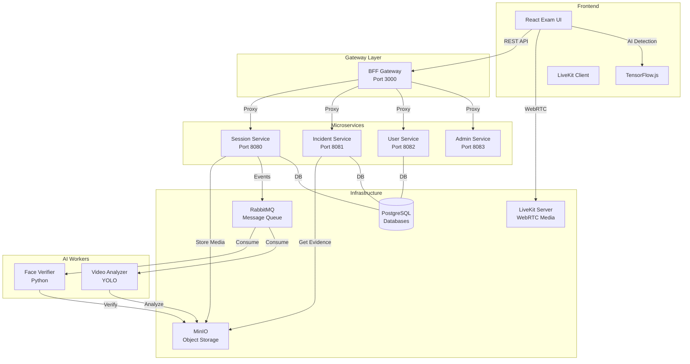

<details>
<summary>📋 Copy Mermaid Code</summary>

```
graph TB
    subgraph "Frontend"
        UI[React Exam UI]
        TF[TensorFlow.js]
        LK[LiveKit Client]
    end
    
    subgraph "Gateway Layer"
        BFF[BFF Gateway<br/>Port 3000]
    end
    
    subgraph "Microservices"
        SESSION[Session Service<br/>Port 8080]
        INCIDENT[Incident Service<br/>Port 8081]
        USER[User Service<br/>Port 8082]
        ADMIN[Admin Service<br/>Port 8083]
    end
    
    subgraph "Infrastructure"
        LIVEKIT[LiveKit Server<br/>WebRTC Media]
        MINIO[MinIO<br/>Object Storage]
        RABBIT[RabbitMQ<br/>Message Queue]
        POSTGRES[(PostgreSQL<br/>Databases)]
    end
    
    subgraph "AI Workers"
        FACE[Face Verifier<br/>Python]
        VIDEO[Video Analyzer<br/>YOLO]
    end
    
    UI -->|REST API| BFF
    UI -->|WebRTC| LIVEKIT
    UI -->|AI Detection| TF
    
    BFF -->|Proxy| SESSION
    BFF -->|Proxy| INCIDENT
    BFF -->|Proxy| USER
    BFF -->|Proxy| ADMIN
    
    SESSION -->|Store Media| MINIO
    SESSION -->|Events| RABBIT
    INCIDENT -->|Get Evidence| MINIO
    
    RABBIT -->|Consume| FACE
    RABBIT -->|Consume| VIDEO
    
    FACE -->|Verify| MINIO
    VIDEO -->|Analyze| MINIO
    
    SESSION ---|DB| POSTGRES
    INCIDENT ---|DB| POSTGRES
    USER ---|DB| POSTGRES
```

</details>

---

## Frontend Detection Logic  

### Core Detection Technologies

#### 1. **TensorFlow.js Face Detection**

**Location**: `useTensorFlowWebcam.ts`, `useOptimizedDetection.ts`

**Models Used**:
- **BlazeFace**: Lightweight face detection (60 FPS)
- **FaceMesh**: 468 facial landmarks for gaze tracking

**Detection Flow**:

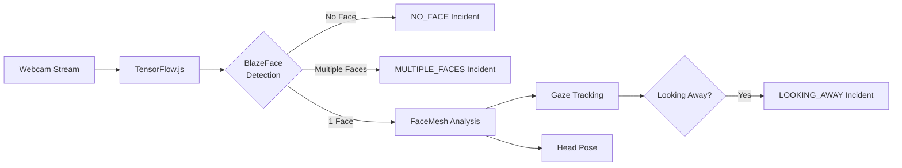

<details>
<summary>📋 Copy Mermaid Code</summary>

```
graph LR
    A[Webcam Stream] --> B[TensorFlow.js]
    B --> C{BlazeFace<br/>Detection}
    C -->|No Face| D[NO_FACE Incident]
    C -->|Multiple Faces| E[MULTIPLE_FACES Incident]
    C -->|1 Face| F[FaceMesh Analysis]
    F --> G[Gaze Tracking]
    F --> H[Head Pose]
    G --> I{Looking Away?}
    I -->|Yes| J[LOOKING_AWAY Incident]
```

</details>

**Key Features**:
- Real-time face detection at 30-60 FPS
- Gaze calibration for looking away detection
- Head pose estimation (pitch, yaw, roll)
- Face quality scoring

**Code Example**:
```typescript
//useOptimizedDetection.ts
const predictions = await model.estimateFaces(video);

if (predictions.length === 0) {
  createIncident('NO_FACE', 'No face detected');
} else if (predictions.length > 1) {
  createIncident('MULTIPLE_FACES', `${predictions.length} faces`);
} else {
  // Analyze gaze direction
  const isLookingAway = analyzeGaze(predictions[0]);
  if (isLookingAway) {
    createIncident('LOOKING_AWAY', 'Eyes off screen');
  }
}
```

---

#### 2. **Behavior Pattern Analysis**

**Location**: `useAnswerBehavior.ts`, `useTemporalAnalysis.ts`

**Metrics Tracked**:
- Answer latency (time to answer)
- Revision count (answer changes)
- Pre-suspicion events (suspicious activity before answering)
- Typing speed patterns
- Micro-pauses

**Analysis Logic**:

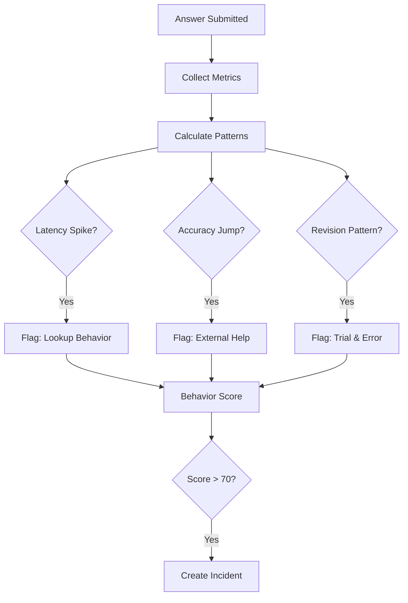

<details>
<summary>📋 Copy Mermaid Code</summary>

```
graph TB
    A[Answer Submitted] --> B[Collect Metrics]
    B --> C[Calculate Patterns]
    C --> D{Latency Spike?}
    C --> E{Accuracy Jump?}
    C --> F{Revision Pattern?}
    
    D -->|Yes| G[Flag: Lookup Behavior]
    E -->|Yes| H[Flag: External Help]
    F -->|Yes| I[Flag: Trial & Error]
    
    G --> J[Behavior Score]
    H --> J
    I --> J
    
    J --> K{Score > 70?}
    K -->|Yes| L[Create Incident]
```

</details>

**Anomaly Detection**:
1. **Latency Spike**: Answer takes 2.5x longer than average
2. **Accuracy Jump**: Sudden improvement (40%+ jump)
3. **Revision Pattern**: 3+ revisions then correct answer
4. **Pre-Suspicion**: Suspicious activity detected before answer

---

#### 3. **Window & Tab Monitoring**

**Location**: `useWindowMonitor.ts`, `useEventDetection.ts`

**Events Tracked**:
- `visibilitychange`: Tab switching
- `blur/focus`: Window focus changes
- `paste`: Clipboard paste attempts
- `resize`: Window resizing
- `contextmenu`: Right-click attempts

**Code**:
```typescript
// useWindowMonitor.ts
document.addEventListener('visibilitychange', () => {
  if (document.hidden) {
    createIncident('TAB_SWITCH', 'Tab switched');
  }
});

document.addEventListener('paste', (e) => {
  e.preventDefault();
  createIncident('PASTE', 'Paste attempt blocked');
});
```

---

#### 4. **Anti-Screenshot Detection**

**Location**: `useAntiScreenshot.ts`

**Methods**:
- **Print Screen Detection**: Monitors clipboard changes
- **Browser Extension Detection**: Checks for screenshot extensions
- **Screen Recording Detection**: Monitors media devices
- **Keyboard Shortcuts**: Blocks Win+PrtScn, Alt+PrtScn

---

#### 5. **Idle Detection**

**Location**: `useIdleDetection.ts`

**Triggers**:
- No mouse movement for 2 minutes
- No keyboard input for 2 minutes
- No answer submission for extended period

---

### Detection Summary Table

| Detection Type | Technology | Frequency | Incident Type |
|----------------|------------|-----------|---------------|
| Face Detection | TensorFlow.js BlazeFace | 30-60 FPS | NO_FACE, MULTIPLE_FACES |
| Gaze Tracking | TensorFlow.js FaceMesh | 15-30 FPS | LOOKING_AWAY |
| Tab Switch | Browser Events | Event-driven | TAB_SWITCH |
| Paste Detection | Clipboard API | Event-driven | PASTE |
| Behavior Analysis | Answer Metrics | Per Answer | ANSWER_BEHAVIOR_ANOMALY |
| Idle Detection | Activity Monitor | Every 30s | USER_IDLE |
| Screenshot | Keyboard/Clipboard | Event-driven | SCREENSHOT_ATTEMPT |

---

## BFF Gateway & Service Integration

### BFF Architecture

**Location**: `gateways/bff/`

**Purpose**: Single entry point for frontend, handles:
- Request proxying to microservices
- Authentication/Authorization
- Request aggregation
- Rate limiting

### Service Routes Mapping

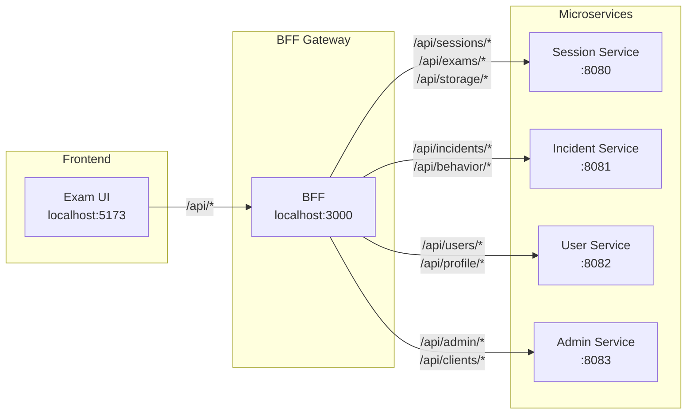

<details>
<summary>📋 Copy Mermaid Code</summary>

```
graph LR
    subgraph "Frontend"
        UI[Exam UI<br/>localhost:5173]
    end
    
    subgraph "BFF Gateway"
        BFF[BFF<br/>localhost:3000]
    end
    
    subgraph "Microservices"
        S1[Session Service<br/>:8080]
        S2[Incident Service<br/>:8081]
        S3[User Service<br/>:8082]
        S4[Admin Service<br/>:8083]
    end
    
    UI -->|/api/*| BFF
    BFF -->|/api/sessions/*<br/>/api/exams/*<br/>/api/storage/*| S1
    BFF -->|/api/incidents/*<br/>/api/behavior/*| S2
    BFF -->|/api/users/*<br/>/api/profile/*| S3
    BFF -->|/api/admin/*<br/>/api/clients/*| S4
```

</details>

### Workflow: Session Service

**Endpoints**:
- `POST /api/sessions` - Create exam session
- `GET /api/sessions/:id` - Get session details
- `POST /api/exams/:id/questions` - Submit answer
- `GET /api/storage/presigned-url` - Get upload URL

**Flow**:

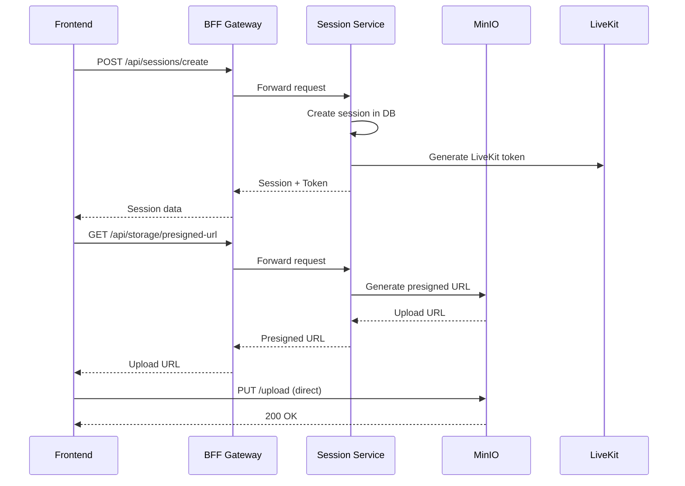

<details>
<summary>📋 Copy Mermaid Code</summary>

```
sequenceDiagram
    participant UI as Frontend
    participant BFF as BFF Gateway
    participant SESSION as Session Service
    participant MINIO as MinIO
    participant LIVEKIT as LiveKit
    
    UI->>BFF: POST /api/sessions/create
    BFF->>SESSION: Forward request
    SESSION->>SESSION: Create session in DB
    SESSION->>LIVEKIT: Generate LiveKit token
    SESSION-->>BFF: Session + Token
    BFF-->>UI: Session data
    
    UI->>BFF: GET /api/storage/presigned-url
    BFF->>SESSION: Forward request
    SESSION->>MINIO: Generate presigned URL
    MINIO-->>SESSION: Upload URL
    SESSION-->>BFF: Presigned URL
    BFF-->>UI: Upload URL
    
    UI->>MINIO: PUT /upload (direct)
    MINIO-->>UI: 200 OK
```

</details>

---

### Workflow: Incident Service

**Endpoints**:
- `POST /api/incidents` - Create incident
- `GET /api/incidents` - List incidents
- `POST /api/behavior/submit` - Submit behavior analysis

**Flow**:

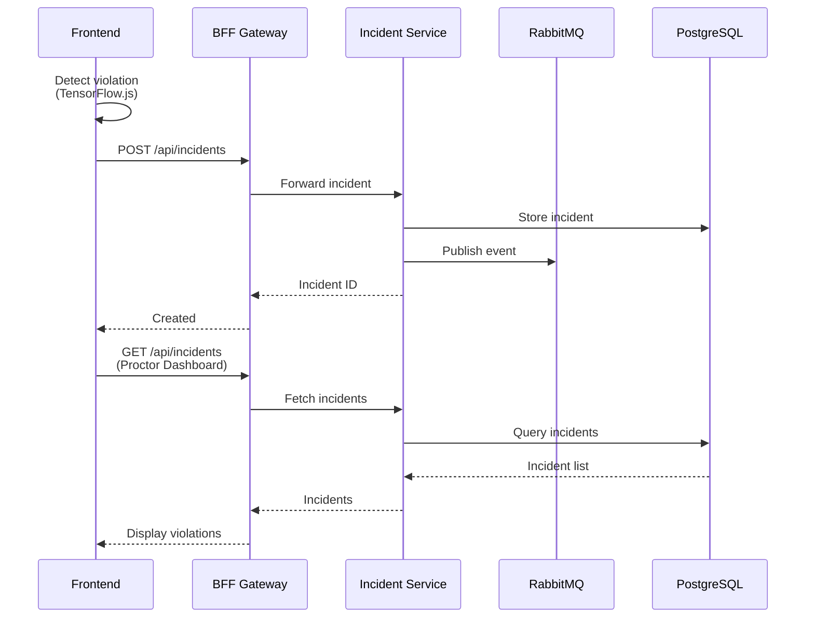

<details>
<summary>📋 Copy Mermaid Code</summary>

```
sequenceDiagram
    participant UI as Frontend
    participant BFF as BFF Gateway
    participant INCIDENT as Incident Service
    participant RABBIT as RabbitMQ
    participant DB as PostgreSQL
    
    UI->>UI: Detect violation<br/>(TensorFlow.js)
    UI->>BFF: POST /api/incidents
    BFF->>INCIDENT: Forward incident
    INCIDENT->>DB: Store incident
    INCIDENT->>RABBIT: Publish event
    INCIDENT-->>BFF: Incident ID
    BFF-->>UI: Created
    
    UI->>BFF: GET /api/incidents<br/>(Proctor Dashboard)
    BFF->>INCIDENT: Fetch incidents
    INCIDENT->>DB: Query incidents
    DB-->>INCIDENT: Incident list
    INCIDENT-->>BFF: Incidents
    BFF-->>UI: Display violations
```

</details>

---

### Workflow: User Service

**Endpoints**:
- `POST /api/users/register` - User registration
- `GET /api/users/:id` - Get user profile
- `POST /api/users/login` - Authentication (via auth-server)

---

## Role-Based Workflows

### 1. Student Exam Flow

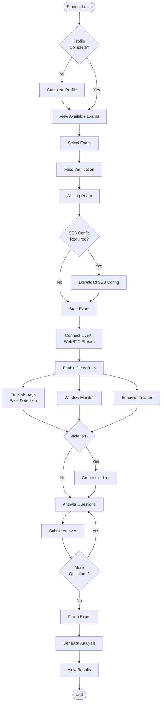

<details>
<summary>📋 Copy Mermaid Code</summary>

```
graph TB
    START([Student Login]) --> PROFILE{Profile<br/>Complete?}
    PROFILE -->|No| COMPLETE[Complete Profile]
    COMPLETE --> EXAMS
    PROFILE -->|Yes| EXAMS[View Available Exams]
    
    EXAMS --> SELECT[Select Exam]
    SELECT --> VERIFY[Face Verification]
    VERIFY --> WAIT[Waiting Room]
    WAIT --> SEB{SEB Config<br/>Required?}
    
    SEB -->|Yes| DOWNLOAD[Download SEB Config]
    SEB -->|No| START_EXAM
    DOWNLOAD --> START_EXAM[Start Exam]
    
    START_EXAM --> LIVEKIT[Connect LiveKit<br/>WebRTC Stream]
    LIVEKIT --> DETECT[Enable Detections]
    
    DETECT --> TF[TensorFlow.js<br/>Face Detection]
    DETECT --> WINDOW[Window Monitor]
    DETECT --> BEHAVIOR[Behavior Tracker]
    
    TF --> INCIDENT{Violation?}
    WINDOW --> INCIDENT
    BEHAVIOR --> INCIDENT
    
    INCIDENT -->|Yes| CREATE[Create Incident]
    INCIDENT -->|No| ANSWER
    
    CREATE --> ANSWER[Answer Questions]
    ANSWER --> SUBMIT[Submit Answer]
    SUBMIT --> MORE{More<br/>Questions?}
    
    MORE -->|Yes| ANSWER
    MORE -->|No| FINISH[Finish Exam]
    
    FINISH --> ANALYSIS[Behavior Analysis]
    ANALYSIS --> RESULTS[View Results]
    RESULTS --> END([End])
```

</details>

**Key Pages**:
- `ExamsPage.tsx` - Exam list
- `StudentStartExamPage.tsx` - Exam start
- `ExamQueueSnapshotPage.tsx` - Face verification
- `ExamWaitingRoom.tsx` - Pre-exam waiting
- `MockExamPage.tsx` - Main exam interface

---

### 2. Proctor Monitoring Flow

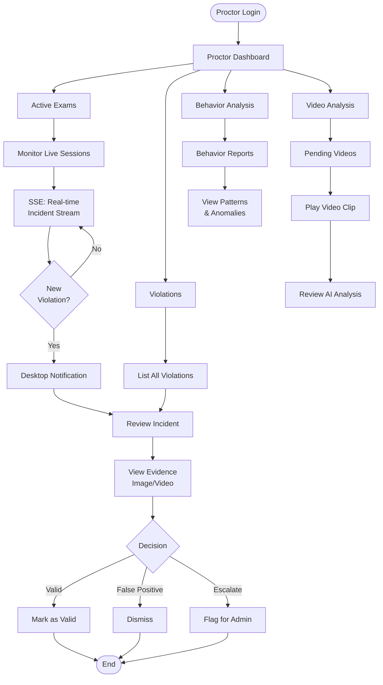

<details>
<summary>📋 Copy Mermaid Code</summary>

```
graph TB
    START([Proctor Login]) --> DASHBOARD[Proctor Dashboard]
    
    DASHBOARD --> ACTIVE[Active Exams]
    DASHBOARD --> VIOLATIONS[Violations]
    DASHBOARD --> VIDEO[Video Analysis]
    DASHBOARD --> BEHAVIOR[Behavior Analysis]
    
    ACTIVE --> MONITOR[Monitor Live Sessions]
    MONITOR --> SSE[SSE: Real-time<br/>Incident Stream]
    SSE --> ALERT{New<br/>Violation?}
    ALERT -->|Yes| NOTIFY[Desktop Notification]
    NOTIFY --> REVIEW
    ALERT -->|No| SSE
    
    VIOLATIONS --> LIST[List All Violations]
    LIST --> REVIEW[Review Incident]
    REVIEW --> EVIDENCE[View Evidence<br/>Image/Video]
    EVIDENCE --> DECISION{Decision}
    
    DECISION -->|Valid| MARK_VALID[Mark as Valid]
    DECISION -->|False Positive| DISMISS[Dismiss]
    DECISION -->|Escalate| FLAG[Flag for Admin]
    
    VIDEO --> VIDEO_LIST[Pending Videos]
    VIDEO_LIST --> PLAY[Play Video Clip]
    PLAY --> VIDEO_REVIEW[Review AI Analysis]
    
    BEHAVIOR --> BEHAVIOR_LIST[Behavior Reports]
    BEHAVIOR_LIST --> CHARTS[View Patterns<br/>& Anomalies]
    
    MARK_VALID --> END([End])
    DISMISS --> END
    FLAG --> END
```

</details>

**Key Pages**:
- `ProctorDashboard.tsx` - Main dashboard
- `ProctorActiveExamsPage.tsx` - Live monitoring
- `ProctorViolationsPage.tsx` - Violation review
- `ProctorVideoAnalysisPage.tsx` - Video review
- `ProctorBehaviorAnalysisPage.tsx` - Behavior patterns

---

### 3. Admin Management Flow

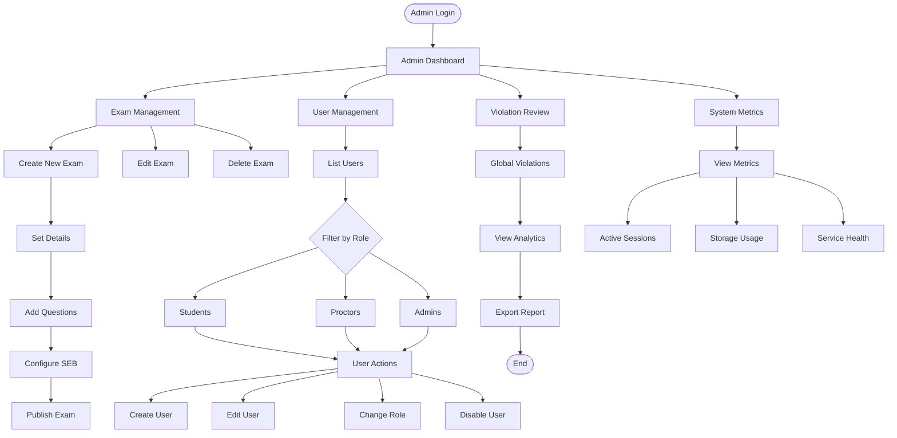

<details>
<summary>📋 Copy Mermaid Code</summary>

```
graph TB
    START([Admin Login]) --> DASHBOARD[Admin Dashboard]
    
    DASHBOARD --> EXAMS[Exam Management]
    DASHBOARD --> USERS[User Management]
    DASHBOARD --> VIOLATIONS[Violation Review]
    DASHBOARD --> SYSTEM[System Metrics]
    
    EXAMS --> CREATE[Create New Exam]
    EXAMS --> EDIT[Edit Exam]
    EXAMS --> DELETE[Delete Exam]
    
    CREATE --> DETAILS[Set Details]
    DETAILS --> QUESTIONS[Add Questions]
    QUESTIONS --> SEB_CONFIG[Configure SEB]
    SEB_CONFIG --> PUBLISH[Publish Exam]
    
    USERS --> LIST[List Users]
    LIST --> FILTER{Filter by Role}
    FILTER --> STUDENT[Students]
    FILTER --> PROCTOR[Proctors]
    FILTER --> ADMIN[Admins]
    
    STUDENT --> USER_ACTION
    PROCTOR --> USER_ACTION
    ADMIN --> USER_ACTION[User Actions]
    
    USER_ACTION --> CREATE_USER[Create User]
    USER_ACTION --> EDIT_USER[Edit User]
    USER_ACTION --> CHANGE_ROLE[Change Role]
    USER_ACTION --> DISABLE[Disable User]
    
    VIOLATIONS --> GLOBAL_VIEW[Global Violations]
    GLOBAL_VIEW --> ANALYTICS[View Analytics]
    ANALYTICS --> EXPORT[Export Report]
    
    SYSTEM --> METRICS[View Metrics]
    METRICS --> SESSIONS[Active Sessions]
    METRICS --> STORAGE[Storage Usage]
    METRICS --> HEALTH[Service Health]
    
    EXPORT --> END([End])
```

</details>

**Key Pages**:
- `AdminExamsPage.tsx` - Exam CRUD
- `AdminCreateExamPage.tsx` - Exam creation
- `AdminUsersPage.tsx` - User management
- `AdminViolationsPage.tsx` - Global violations
- `AdminSystemPage.tsx` - System monitoring

---

## Technology Stack

### Frontend Technologies

| Technology | Purpose | Version |
|------------|---------|---------|
| **React** | UI Framework | 18.x |
| **TypeScript** | Type Safety | 5.x |
| **Vite** | Build Tool | 5.x |
| **React Router** | Routing | 6.x |
| **TensorFlow.js** | AI Detection | 4.x |
| **LiveKit Client SDK** | WebRTC | Latest |
| **Zustand** | State Management | 4.x |
| **Axios** | HTTP Client | 1.x |
| **Lucide React** | Icons | Latest |

### Backend Technologies

| Service | Framework | Language | Database |
|---------|-----------|----------|----------|
| **Session Service** | Spring Boot 3.2 | Java 17 | PostgreSQL |
| **Incident Service** | Spring Boot 3.2 | Java 17 | PostgreSQL |
| **User Service** | Spring Boot 3.2 | Java 17 | PostgreSQL |
| **Admin Service** | Spring Boot 3.2 | Java 17 | N/A (Proxy) |
| **BFF Gateway** | Express.js | TypeScript | N/A |
| **Auth Server** | Spring Authorization Server | Java 17 | PostgreSQL |

### Infrastructure

| Component | Technology | Purpose |
|-----------|------------|---------|
| **Media Server** | LiveKit | WebRTC streaming |
| **Object Storage** | MinIO | Media file storage |
| **Message Queue** | RabbitMQ | Async processing |
| **Database** | PostgreSQL | Persistent storage |
| **AI Worker** | Python + TensorFlow | Face verification |
| **Video Analysis** | Python + YOLO | Video analysis |

---

## Data Flow

### Incident Creation Flow

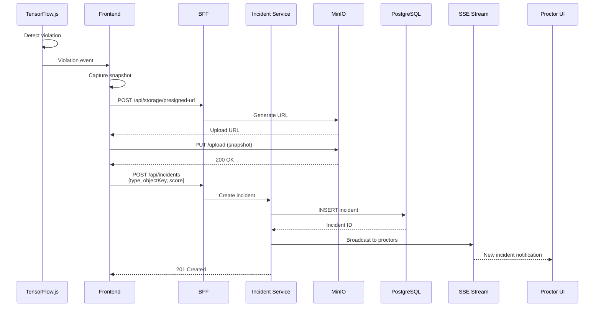

<details>
<summary>📋 Copy Mermaid Code</summary>

```
sequenceDiagram
    participant TF as TensorFlow.js
    participant UI as Frontend
    participant BFF as BFF
    participant INC as Incident Service
    participant MINIO as MinIO
    participant DB as PostgreSQL
    participant SSE as SSE Stream
    participant PROCTOR as Proctor UI
    
    TF->>TF: Detect violation
    TF->>UI: Violation event
    UI->>UI: Capture snapshot
    UI->>BFF: POST /api/storage/presigned-url
    BFF->>MINIO: Generate URL
    MINIO-->>UI: Upload URL
    
    UI->>MINIO: PUT /upload (snapshot)
    MINIO-->>UI: 200 OK
    
    UI->>BFF: POST /api/incidents<br/>{type, objectKey, score}
    BFF->>INC: Create incident
    INC->>DB: INSERT incident
    DB-->>INC: Incident ID
    
    INC->>SSE: Broadcast to proctors
    SSE-->>PROCTOR: New incident notification
    
    INC-->>UI: 201 Created
```

</details>

---

### Video Recording Flow

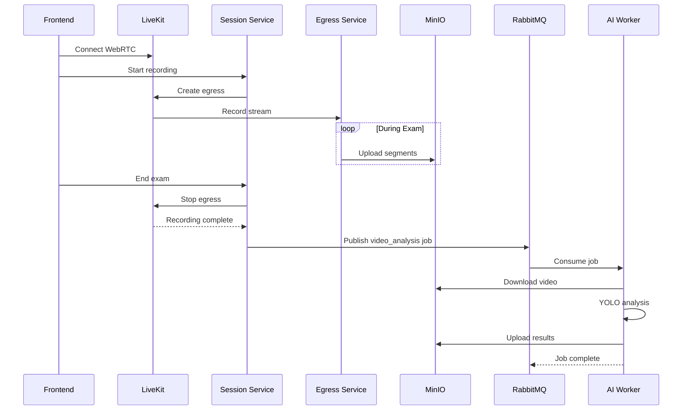

<details>
<summary>📋 Copy Mermaid Code</summary>

```
sequenceDiagram
    participant UI as Frontend
    participant LIVEKIT as LiveKit
    participant SESSION as Session Service
    participant EGRESS as Egress Service
    participant MINIO as MinIO
    participant RABBIT as RabbitMQ
    participant WORKER as AI Worker
    
    UI->>LIVEKIT: Connect WebRTC
    UI->>SESSION: Start recording
    SESSION->>LIVEKIT: Create egress
    LIVEKIT->>EGRESS: Record stream
    
    loop During Exam
        EGRESS->>MINIO: Upload segments
    end
    
    UI->>SESSION: End exam
    SESSION->>LIVEKIT: Stop egress
    LIVEKIT-->>SESSION: Recording complete
    
    SESSION->>RABBIT: Publish video_analysis job
    RABBIT->>WORKER: Consume job
    WORKER->>MINIO: Download video
    WORKER->>WORKER: YOLO analysis
    WORKER->>MINIO: Upload results
    WORKER-->>RABBIT: Job complete
```

</details>

---

## Key Features Summary

### Detection Capabilities
✅ Real-time face detection (30-60 FPS)  
✅ Multi-face detection  
✅ Gaze tracking & looking away detection  
✅ Tab switch & window blur detection  
✅ Clipboard paste prevention  
✅ Screenshot attempt blocking  
✅ Idle user detection  
✅ Answer behavior analysis  
✅ Pre-suspicion pattern detection  
✅ Temporal pattern analysis  

### Monitoring Features
✅ Live exam monitoring (Proctor)  
✅ Real-time incident streaming (SSE)  
✅ Video recording & playback  
✅ AI-powered video analysis (YOLO)  
✅ Behavior anomaly reports  
✅ Evidence management (images/videos)

### Security Features
✅ OAuth 2.0 authentication  
✅ Role-based access control (RBAC)  
✅ Safe Exam Browser (SEB) integration  
✅ Presigned URL for secure uploads  
✅ Anti-screenshot protection  
✅ Session isolation  

### Infrastructure
✅ Microservices architecture  
✅ Event-driven processing (RabbitMQ)  
✅ Scalable media streaming (LiveKit)  
✅ Object storage (MinIO)  
✅ BFF gateway pattern  
✅ Async AI processing

---

## Conclusion

The Exam Cheating Detection system represents a production-grade implementation of AI-powered online proctoring with comprehensive real-time monitoring, behavior analysis, and incident management capabilities.

**Architecture Highlights**:
- Microservices for scalability
- Event-driven async processing
- Real-time WebRTC streaming
- AI-powered detection (TensorFlow.js + Python)
- Role-based workflows for Student/Proctor/Admin

**Performance**:
- 30-60 FPS face detection
- <100ms incident creation
- Real-time SSE notifications
- Scalable media handling (LiveKit + MinIO)
